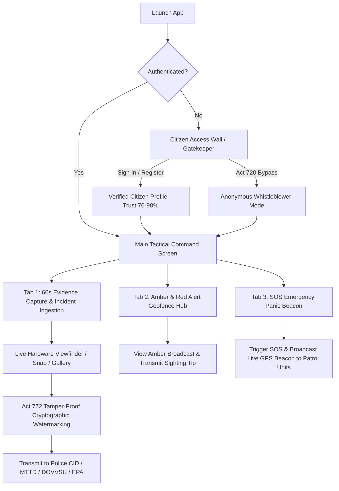
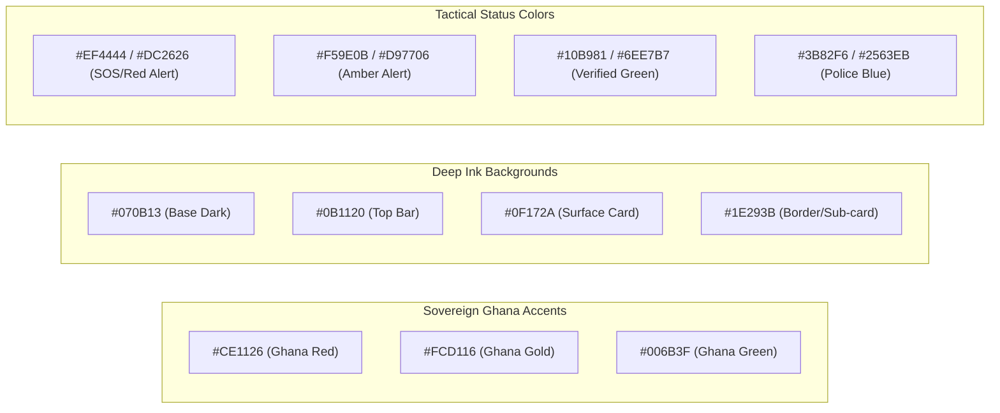

# CitizenAlert Ghana (Mobile) — Comprehensive UI/UX & Architectural Design Audit 🇬🇭

**Document Version:** 1.0.0  
**Audit Date:** October 2026  
**Auditor:** Senior Mobile Product Designer & Mobile Systems Engineer  
**Target Codebase:** `mobile-expo/` (Primary React Native App) & `mobile/` (Flutter Reference Prototype)

---

## 1. App Overview

### 1.1 Purpose & Mission
**CitizenAlert Ghana** is the official citizen-facing mobile gateway for the Republic of Ghana's National Civic Safety and Emergency Command Network. Its purpose is to empower Ghanaian citizens to capture and transmit tamper-proof, cryptographically signed incident reports (video evidence, photos, geo-telemetry, and GhanaPost GPS codes) directly to the Ghana Police Service CID, DOVVSU, EPA, MTTD, and National Security Command Center.

### 1.2 Target Audience & User Personas
1. **Everyday Ghanaian Citizens & Commuters:** Reporting reckless driving, road accidents (MTTD), infrastructure hazards, domestic abuse (DOVVSU), or public safety threats. Requires low barrier-to-entry, simple high-contrast visual cues, and multi-language support (English, Twi, Ga, Ewe, Hausa).
2. **Whistleblowers & Environmental Defenders:** Reporting illegal mining (*galamsey*), corruption, or organized crime under the legal immunity of the **Whistleblower Act, 2006 (Act 720)**. Requires verifiable anonymity and zero device metadata retention.
3. **Emergency Victims in Distress:** Citizens facing imminent physical peril requiring rapid one-touch distress transmission (**SOS Panic Beacon**) with real-time GPS coordinate streaming to nearest rapid-response police patrols.

### 1.3 Core User Flows


### 1.4 Tone and Personality
* **Current UI Tone:** Functional, urgent, highly utilitarian, tactical dark-mode police aesthetic.
* **Perceived Experience:** Heavy reliance on raw emojis (🚨, 📸, 🛡️, 🇬🇭, ⛽, ⚠️), unpolished padding, crowded controls, and high cognitive load. It communicates high authority and statutory seriousness (referencing Acts 720, 772, 843), but feels like an unrefined engineering prototype rather than an intuitive, world-class national defense tool.

---

## 2. Tech Stack & Dependencies

### 2.1 Core Framework & Platform Specifications
| Component | Specification | Notes / Code Evidence |
| :--- | :--- | :--- |
| **Framework** | **React Native `0.86.3`** | Running via Expo SDK `^57.0.27` |
| **Language** | **TypeScript `~6.0.3`** | `tsconfig.json` extending `expo/tsconfig.base` |
| **Core React** | **React `19.2.3` / `react-dom`** | Bleeding-edge React 19 runtime |
| **Target OS** | **iOS & Android** | iOS Bundle ID: `gh.gov.safety.citizenalert`<br/>Android Package: `gh.gov.safety.citizenalert` |
| **Orientation** | Portrait Only | Defined in `mobile-expo/app.json` |
| **Theme Mode** | Dark Interface Only (`#070B13`) | Set via `userInterfaceStyle: "dark"` in `app.json` |

### 2.2 Navigation Architecture
* **Current Navigation:** **State-Driven Monolithic Pseudo-Tabs** (`useState<'CAPTURE' | 'ALERTS' | 'SOS'>('CAPTURE')`) inside a single `App.tsx` file.
* **Drawbacks:** No URL/Deep linking capability, no native gesture transitions, no native stack back-button support, and re-renders the entire application on every tab change or input focus.

### 2.3 State Management & Data Layer
* **State Management:** Local React Hooks (`useState`, `useEffect`, `useRef`) in `App.tsx` (over 30 independent state hooks).
* **Backend / API Client:** `@supabase/supabase-js ^2.117.3` connected to Supabase (`https://fqgujgwdgqlxnpmpmiui.supabase.co`) with custom `ExpoSecureStoreAdapter` (`expo-secure-store`).
* **Auth Session Handling:** Supabase OAuth + Google Sign-In with hybrid fallback (`@react-native-google-signin/google-signin` with native turbo module check + `expo-auth-session` / `expo-web-browser` fallback).

### 2.4 Styling & UI Primitives
* **Styling Approach:** React Native `StyleSheet.create()`.
* **Design Tokens:** None. All colors, font sizes, margins, paddings, and borders are hardcoded repeatedly across styles.
* **Iconography:** System emoji characters (`📸`, `📁`, `📍`, `🛡️`, `⛽`, `🚨`, `👁️`, `✕`). No vector icon library.
* **Typography:** System default fonts on iOS/Android; monospace fallback for coordinates and watermarks.

### 2.5 Dependencies & Health Check
```json
{
  "dependencies": {
    "@react-native-google-signin/google-signin": "^16.1.5",
    "@supabase/supabase-js": "^2.117.3",
    "base64-arraybuffer": "^1.0.2",
    "expo": "^57.0.27",
    "expo-auth-session": "^57.0.14",
    "expo-camera": "^57.0.6",
    "expo-crypto": "^57.0.3",
    "expo-dev-client": "^57.0.19",
    "expo-file-system": "^57.0.7",
    "expo-image-picker": "^57.0.20",
    "expo-linking": "^57.0.12",
    "expo-location": "^57.0.20",
    "expo-secure-store": "^57.0.4",
    "expo-status-bar": "~57.0.1",
    "expo-web-browser": "^57.0.3",
    "react": "19.2.3",
    "react-dom": "^19.2.3",
    "react-native": "0.86.3",
    "react-native-safe-area-context": "^5.10.1",
    "react-native-url-polyfill": "^4.0.0",
    "react-native-web": "^0.21.3"
  }
}
```

#### ⚠️ Dependency & Architectural Flags:
1. **Monolithic Architecture Risk:** `mobile-expo/App.tsx` is **2,423 lines long (80 KB)** containing all logic, camera control, location listeners, geocoding, file encryption, upload buffers, and rendering.
2. **`expo-file-system/legacy` Import:** `App.tsx` imports from `expo-file-system/legacy` (line 25), indicating reliance on deprecated file system APIs rather than the modern typed FileSystem API.
3. **JS-Thread Base64 Decoding:** Video uploads read the entire 60s video into memory as Base64 (`FileSystem.readAsStringAsync`) and convert it via `base64-arraybuffer` on the main JavaScript thread, which can cause frame drops and app freezing during video evidence transmission on mid-tier Android devices.
4. **Missing Production UI Packages:** Missing `lucide-react-native` (or vector icons), `react-native-reanimated`, `expo-haptics`, and custom typography packages (`@expo-google-fonts/plus-jakarta-sans`, `jetbrains-mono`).

---

## 3. Screen & Component Inventory

| Screen / Flow | File Path & Lines | Key UI Elements | Reusable Components | Navigation Triggers | Current UX & Visual Weaknesses |
| :--- | :--- | :--- | :--- | :--- | :--- |
| **Citizen Access Wall (Gatekeeper)** | `src/components/CitizenAccessWall.tsx`<br/>*(Lines 1–819)* | • Ghana flag bar<br/>• Mode switcher (Sign In / Register / Whistleblower)<br/>• Google OAuth button<br/>• Email/Password/Phone/Ghana Card inputs<br/>• Whistleblower immunity card (Act 720) | Custom inner card, input groups, primary buttons | App launch (if unauthenticated) &rarr; Sets citizen session &rarr; Unlocks Main App | • Flat inputs with low visual depth<br/>• Emoji badges look amateurish<br/>• Mode switcher tabs have uneven tap padding<br/>• Hardcoded form validation alerts<br/>• Lack of smooth keyboard transition |
| **Evidence Capture & Ingestion (Tab 1)** | `App.tsx`<br/>*(Lines 989–1427)* | • Language switcher (EN, TW, GA, EE, HA)<br/>• Citizen identity pill<br/>• GPS HUD with live accuracy & recalibration<br/>• Live hardware camera viewfinder (`CameraView`)<br/>• Tamper-proof watermark HUD<br/>• Record / Snap / Gallery toolbar<br/>• Upload progress card<br/>• Landmark chips & input<br/>• Auto GhanaPost GPS input<br/>• Category selection cards<br/>• Title, details, anonymous toggle | None (inline JSX) | Tab bar &rarr; `CAPTURE`<br/>Gallery picker / Camera record &rarr; Supabase upload | • Huge cognitive overload (12+ form fields & camera on one scroll view)<br/>• Camera wrapper height fixed at `250px` (crops 16:9 feed)<br/>• Landmark chips horizontal scroll overlaps keyboard<br/>• Record button styling is basic<br/>• Category cards take up vertical screen space |
| **Amber & Red Alerts Geofence Hub (Tab 2)** | `App.tsx`<br/>*(Lines 1429–1452)* | • Amber alert geofence broadcast banner<br/>• Victim details (Emmanuel Boateng)<br/>• Broadcast center radius tag<br/>• "Send Sighting Tip to Police" CTA button | Inline banner card | Tab bar &rarr; `ALERTS`<br/>Sighting button &rarr; Supabase insert | • Only 1 hardcoded mock Amber Alert; no dynamic list or empty state<br/>• No map view showing the 35km geofence radius<br/>• No photo or suspect image in the alert card<br/>• Sighting tip sends instant alert without dedicated intake modal |
| **SOS Emergency Panic Beacon (Tab 3)** | `App.tsx`<br/>*(Lines 1454–1482)* | • Giant pulsing red SOS button (`170x170px`)<br/>• Emergency beacon text & coordinate lock<br/>• Live tracking active card<br/>• Ping counter & Cancel beacon button | Inline SOS button & card | Tab bar &rarr; `SOS`<br/>SOS button &rarr; Live CAD dispatch | • SOS button lacks haptic vibration feedback<br/>• No countdown timer to prevent accidental triggers<br/>• No quick dialer fallback (191 / 112 / 18555)<br/>• Active tracking card is text-only without radar ripple visual |
| **Citizen Profile & Trust Vault Modal** | `App.tsx`<br/>*(Lines 1487–1614)* | • Slide-over modal card<br/>• Trust score pill (`90/100 TRUST`)<br/>• Verified contact credentials<br/>• Ghana Card status<br/>• Whistleblower mode toggle<br/>• Lock App / Sign Out button | React Native `<Modal>` | Tap citizen badge pill &rarr; Open modal &rarr; Sign Out / Dismiss | • Modal is a centered dialog rather than modern iOS/Android bottom sheet<br/>• No avatar image upload or profile picture support<br/>• Sign-out confirmation uses raw system alert<br/>• Trust score breakdown is unexplained |

---

## 4. Design System Audit

### 4.1 Exhaustive Palette Breakdown
The application currently uses **26 distinct hardcoded hex and rgba color strings** across its components without a unified token system:



#### Complete Color Value Registry:
| Hex / RGBA Code | Current Context / Usage | Recommended Design System Token |
| :--- | :--- | :--- |
| `#070B13` | App root background, input background | `colors.bg.base` (Deep Midnight Ink) |
| `#0B1120` | Profile bar background | `colors.bg.subtle` |
| `#0F172A` | Card surfaces, modal surfaces, tab backgrounds | `colors.surface.card` (Slate Ink) |
| `#1E293B` | Border lines, category cards, toggle off state | `colors.border.subtle` |
| `#334155` | Input borders, chip borders, dividers | `colors.border.medium` |
| `#475569` | Avatar borders, secondary dividers | `colors.border.strong` |
| `#64748b` | Placeholder text, subtitle labels, icons | `colors.text.muted` |
| `#94a3b8` | Field labels, meta text, secondary captions | `colors.text.secondary` |
| `#cbd5e1` | Input labels, body copy | `colors.text.primary` |
| `#ffffff` | Headers, active titles, button text | `colors.text.inverse` / White |
| `#FCD116` | Ghana Gold, primary buttons, watermark tags | `colors.brand.gold` (Sovereign Gold) |
| `#CE1126` | Ghana Flag red band | `colors.brand.red` |
| `#006B3F` | Ghana Flag green band, Act 720 shield button | `colors.brand.green` (Forest Green) |
| `#10B981` | GPS lock dot, upload complete bar, trust score pill | `colors.status.success` |
| `#3B82F6` | Police blue accents, upload progress bar | `colors.police.accent` |
| `#2563EB` | Active tab background, phone auth CTA | `colors.police.primary` |
| `#1E3A8A` | Act 720 badge border, active category border | `colors.police.dark` |
| `#EF4444` | Live recording dot, SOS border, error box border | `colors.status.danger` |
| `#DC2626` | Stop recording button, SOS button, sign out CTA | `colors.status.emergency` |
| `#991B1B` | Active SOS pressed state | `colors.status.emergencyActive` |
| `#7F1D1D` | SOS thick border | `colors.status.emergencyRing` |
| `#F59E0B` | Amber alert title, GPS locating indicator | `colors.status.warning` |
| `#D97706` | Amber alert tab, sighting button | `colors.status.amber` |
| `#6EE7B7` | Whistleblower feature checklist text | `colors.brand.greenLight` |
| `#38BDF8` | Upload size text | `colors.brand.sky` |
| `rgba(...)` | Various ad-hoc background opacities (15%, 20%, 40%, 75%, 85%) | Standardize with `tokens.opacity` scale |

### 4.2 Typography Audit
* **Font Family:** Default system sans-serif (`System` on iOS / `Roboto` on Android) without custom branding. Monospace (`fontFamily: 'monospace'`) used for GPS & watermarks.
* **Sizes & Hierarchy Inconsistencies:**
  * App Title: `24px` (Access Wall) vs `18px` (Main Top Bar).
  * Form Field Labels: Variously `12px` bold, `11px` bold, `10px` bold, or `9px` bold.
  * Captions & Footers: Range between `9px` and `12px`.
  * Line Heights: Mostly omitted, causing compressed line spacing on multiline alerts.
* **Recommended Scale:** Modern Plus Jakarta Sans (Headers & UI) + JetBrains Mono (Telemetry, Tracking Codes, GhanaPost GPS, Timestamps).

### 4.3 Spacing, Radii, and Shadows
* **Border Radii:** Inconsistent: `3px` (progress bar), `6px` (badges), `8px` (buttons), `10px` (tabs), `12px` (inputs), `14px` (landmark box), `16px` (toolbar), `18px` (camera), `20px` (cards), `32px`/`34px`/`85px` (circular buttons).
* **Shadows:** Hardcoded iOS shadow properties (`shadowColor`, `shadowOpacity`, `shadowRadius`) with mixed Android `elevation` (ranging from `4` to `15`), lacking consistent elevation levels.

---

## 5. UX, Accessibility, and Performance Review

### 5.1 UX & Navigation Friction Points
1. **Single Scroll Screen Overload:** On Tab 1 (`CAPTURE`), the user must navigate GPS HUD, camera viewfinder, record toolbar, upload progress, landmark suggestions, area name, GhanaPost code, category grid, title, multiline description, whistleblower toggle, and submit button—all in a single vertical scroll view. When the soft keyboard appears, it obscures vital controls.
2. **Accidental SOS Risk:** The SOS Emergency button triggers an immediate live dispatch to the Police CAD on a single tap without a press-and-hold confirmation or countdown safeguard.
3. **No Offline Queue Management UI:** Although code references saving to an offline queue upon failure, there is no screen or badge showing pending offline reports, sync status, or manual retry triggers.

### 5.2 Accessibility (A11y) Gaps
* **Touch Target Size (<44pt / 48dp):**
  * Language buttons: `paddingHorizontal: 6, paddingVertical: 3` (Target height: ~24px).
  * Keyboard dismiss buttons ("✕ Hide", "✕ Done"): ~20px height.
  * Modal close button: ~28px height.
* **Color Contrast:**
  * Muted subtext `#64748b` on `#070B13` has a contrast ratio of **3.4:1** (fails WCAG AA 4.5:1 requirement for small text).
* **Screen Reader & Semantics:**
  * Only one button in the entire app has an `accessibilityLabel` (`App.tsx` line 1175). All other touchables lack accessible roles, hints, and labels.

### 5.3 Performance & Re-render Profile
* **Keystroke Re-render Storm:** Because all form inputs (`title`, `description`, `landmark`, `locationName`, `ghanaPostCode`) reside in `App.tsx`, typing a single character in the description field causes the camera viewfinder, GPS HUD, and all child views to re-render.
* **Timer Re-render Overhead:** During video recording, `recordingSeconds` increments every second, triggering 60 top-level app re-renders during active capture.
* **Large Base64 Buffer Memory Spike:** Reading raw video files into Base64 strings in JavaScript memory before uploading can cause low-memory crashes on devices with 2GB–3GB RAM.

---

## 6. Strict Architectural Constraints (What Must NOT Break)

The following components represent core business logic and statutory requirements that must remain strictly functional during any redesign:

1. **Supabase Database Schema & Field Mapping:**
   * Table: `incidents`
   * Mandatory columns: `tracking_code`, `category`, `title`, `description`, `location_name`, `ghanapost_code`, `region`, `latitude`, `longitude`, `media`, `is_anonymous`, `reporter_data`, `assigned_agency`, `status`, `severity`, `is_public_eligible`, `is_public_published`, `public_corroborations`.
2. **Statutory 60-Second Video Duration Limit:**
   * In-app camera recording must automatically cease at 60 seconds with strict duration enforcement.
3. **Act 772 & Act 720 Legal Watermarking & Cryptographic Hashing:**
   * SHA-256 evidence integrity hashing (`Crypto.digestStringAsync`).
   * Live GPS coordinates (lat, lng, accuracy) and GhanaPost digital address formatting.
   * Whistleblower mode: absolute stripping of device and citizen identifiers.
4. **Dual Auth Integration:**
   * Supabase native email/password + session storage in `expo-secure-store`.
   * Google Sign-In with WebBrowser fallback for Expo Go compatibility.
5. **Storage Bucket Structure:**
   * Supabase Storage Bucket: `evidence`.

---

## 7. Design Upgrade Opportunities

### 7.1 Top 10 Highest-Impact Improvements

| Rank | Improvement | Impact | Effort | Value Proposition |
| :---: | :--- | :---: | :---: | :--- |
| **1** | **Modular Screen & Component Refactor** | 🔥 Very High | Medium | Break monolithic `App.tsx` into modular screens, hooks, and clean components. Eliminates re-render lag. |
| **2** | **Central Design Tokens & Theme Engine** | 🔥 Very High | Low | Establish unified palette, typography, spacing, and radius tokens in `src/theme/tokens.ts`. |
| **3** | **Pro Vector Iconography (`lucide-react-native`)** | 🔥 High | Low | Replace all amateur system emojis with crisp, professional dual-tone vector icons. |
| **4** | **Streamlined Multi-Step Incident Capture Sheet** | 🔥 High | Medium | Convert crowded single scroll into a smooth 3-step capture flow: (1) Viewfinder & Evidence &rarr; (2) Incident Details &rarr; (3) Review & Transmit. |
| **5** | **Tactical Floating HUD Viewfinder** | 🔥 High | Medium | Edge-to-edge camera viewport with minimalist semi-transparent glass telemetry overlay. |
| **6** | **SOS Panic Beacon Safety Countdown & Haptics** | 🔥 High | Low | Add a 3-second hold-to-activate ring with `expo-haptics` vibration pulses and emergency hotlines (191/112). |
| **7** | **Interactive Amber Alert Cards with Geo-Radius Map** | ⚡ Medium | Medium | Render visual Amber Alert cards with sighting photo uploads, geofence radius tags, and status badges. |
| **8** | **Offline Queue Drawer & Sync Manager** | ⚡ Medium | Medium | Dedicated bottom sheet showing encrypted offline incidents with auto-sync status and retry buttons. |
| **9** | **Refined Citizen Profile & Trust Score Vault** | ⚡ Medium | Low | Modern bottom sheet displaying verified credentials, trust level meter, and Act 720 toggle. |
| **10** | **Custom Brand Typography (Plus Jakarta Sans + JetBrains Mono)** | ⚡ Medium | Low | Load Google Fonts for clean government-grade legibility and authentic cryptographic telemetry display. |

---

### 7.2 Three Distinct Modern Design Directions

#### Direction A: "National Civic Aegis" (Sleek Sovereign Tactical Dark) — *RECOMMENDED*
* **Mood:** Authoritative, high-tech, sovereign, mission-critical, crisp.
* **Palette:** Deep Midnight Ink (`#070B13`, `#0F172A`), Sovereign Ghana Gold (`#F59E0B`, `#FCD116`), Tactical Police Blue (`#1E3A8A`, `#3B82F6`), Emergency Crimson (`#EF4444`), Emerald Verified (`#10B981`).
* **Typography:** *Plus Jakarta Sans* (Bold, 800 headings, 600 UI labels) + *JetBrains Mono* (Telemetry, Watermarks, Timestamps).
* **Component Style:** Glassmorphic translucent cards (`rgba(15, 23, 42, 0.75)` with subtle borders `#1E293B`), refined pill tabs, tactical corner brackets on the camera viewfinder, smooth progress rings.
* **Motion & Haptics:** Snappy micro-interactions, heavy haptic feedback on shutter/record, pulsing radar rings on urgent alerts.
* **Reference Inspiration:** Citizen App, Palantir Mobile, DJI Fly Tactical Camera, Apple Emergency SOS.

#### Direction B: "Sovereign Modern Luminescence" (High-Clarity Dual Theme)
* **Mood:** Approachable, institutional, trustworthy, accessible across all demographics.
* **Palette:** Crisp Slate Dark / Clean Off-White, Ghana Gold (#D97706), Deep Royal Navy (#0A192F), Forest Green (#006B3F).
* **Typography:** *Inter* or *Cabinet Grotesk* for UI, *SF Mono* for coordinates.
* **Component Style:** Solid high-contrast cards, large accessible touch targets, high contrast borders, clear icon labels.
* **Motion:** Subtle linear page fades, gentle spring sheets.
* **Reference Inspiration:** Gov.uk Mobile, Estonia e-Residency app, Revolut Security Hub.

#### Direction C: "Ghana Shield Neo-Utility" (High-Contrast Civic Defense)
* **Mood:** Bold, punchy, high-urgency, unmistakable visual contrast for field operations.
* **Palette:** Pitch Black (`#000000`), High-Vis Safety Gold (`#FFE500`), Signal Red (`#FF1E1E`), Safety Green (`#00E676`).
* **Typography:** *Space Grotesk* (Heavy Display) + *Roboto Mono*.
* **Component Style:** Thick 2px borders, sharp corners (`borderRadius: 8`), prominent badge stamps, high-contrast segmented toggles.
* **Motion:** Punchy step animations, bold status state changes.
* **Reference Inspiration:** Teenage Engineering field apps, Nothing OS UI, Citizen Field Reporter.

---

### 7.3 Motion, Gestures & Micro-Interactions
1. **Shutter / Record Button:** Long-press to record video, tap to snap photo, with an animated circular progress border that fills from 0s to 60s.
2. **SOS Panic Trigger:** 3-second hold-to-activate circular progress meter with ramping haptic pulses (`ImpactFeedbackStyle.Heavy`), preventing accidental triggering while ensuring swift execution.
3. **Telemetry Watermark HUD:** Subtle live green beacon ping indicator with smooth coordinate transitions as accuracy refines.
4. **Bottom Sheets:** Modal dialogues replaced with smooth swipe-to-dismiss gesture bottom sheets (`react-native-safe-area-context` + smooth transitions).

---

## 8. Proposed Implementation Plan

### Phase 1: Foundation, Tokens & Architecture Refactor
* **Goal:** Modularize `App.tsx` and establish the design system tokens without altering any business logic.
* **Tasks:**
  1. Create `src/theme/tokens.ts` (colors, typography, spacing, radius, shadows, opacity).
  2. Install design libraries: `lucide-react-native`, `expo-haptics`, `expo-font`, `@expo-google-fonts/plus-jakarta-sans`, `@expo-google-fonts/jetbrains-mono`.
  3. Decompose `App.tsx` into clean modular directories:
     * `src/screens/EvidenceCaptureScreen.tsx`
     * `src/screens/AmberAlertsScreen.tsx`
     * `src/screens/SosPanicScreen.tsx`
     * `src/components/ViewfinderOverlay.tsx`
     * `src/components/GpsTelemetryCard.tsx`
     * `src/components/UploadProgressHud.tsx`
     * `src/components/CitizenProfileModal.tsx`
     * `src/hooks/useGpsLocation.ts`
     * `src/hooks/useCameraRecorder.ts`
* **Verification:** App compiles and runs cleanly in Expo; all state, capture, and upload operations work identically.

### Phase 2: Core Component & Visual Upgrade
* **Goal:** Implement the "National Civic Aegis" design direction with vector iconography, refined cards, and custom typography.
* **Tasks:**
  1. Replace all system emojis with contextual Lucide icons (`Camera`, `Video`, `ShieldCheck`, `AlertTriangle`, `MapPin`, `Radio`, `FileText`, `Lock`).
  2. Implement the edge-to-edge camera viewfinder with tactical glass telemetry overlay.
  3. Upgrade the 60s record button with radial progress ring and smooth transitions.
  4. Redesign the Access Wall / Auth screen with high-tier government identity styling.
* **Verification:** Visual verification of all screens; test responsive layout on small and large device viewports.

### Phase 3: SOS Safeguards, Micro-Interactions & A11y Polish
* **Goal:** Add haptic feedback, SOS countdown safeguards, and accessibility compliance.
* **Tasks:**
  1. Add 3-second press-and-hold trigger on SOS Panic with `expo-haptics` and emergency cancel window.
  2. Expand touch targets to meet minimum 44pt WCAG AA requirements.
  3. Ensure `accessibilityLabel` and `accessibilityRole` on all interactive touchables.
  4. Optimize file upload buffers to eliminate JS-thread blocking.
* **Verification:** Full end-to-end test of photo snap, 60s video record, Supabase upload, SOS trigger, and Google auth.

---

## 9. Questions for Alignment

To tailor the redesign precisely to your vision, please review and answer the following questions:

1. **Design Direction Choice:** Do you prefer **Direction A ("National Civic Aegis" - Sleek Tactical Dark)**, or would you like to explore **Direction B (Modern Dual Theme)** or **Direction C (High-Contrast Neo-Utility)**?
2. **Screen Flow Preference:** Would you prefer the Evidence Capture screen to remain as a single scrollable page, or be organized into a multi-step progressive flow (1: Capture Media &rarr; 2: Location & Details &rarr; 3: Submit)?
3. **SOS Trigger Behavior:** Do you approve changing the instant-tap SOS button to a **3-second hold-to-activate** button (with haptic pulses and a 5-second cancel window) to prevent accidental emergency dispatches?
4. **Icon Library:** Are you happy to add `lucide-react-native` for clean, modern vector icons across all screens?
5. **Brand Typography:** Do you approve loading **Plus Jakarta Sans** and **JetBrains Mono** via `@expo-google-fonts` for government-grade readability?

---
*Report delivered and saved to `MOBILE_DESIGN_AUDIT.md`.*
