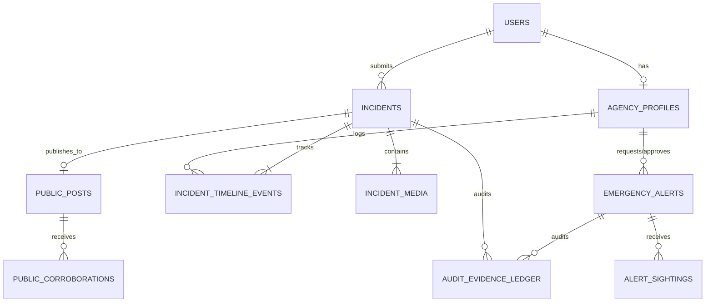

# CitizenAlert Ghana — Relational & Spatial Data Model

## 1. Database Architecture & Engine Standards
- **Primary Database Engine:** PostgreSQL 16 Enterprise
- **Spatial Extension:** PostGIS 3.4 (WGS 84, SRID 4326 for global coordinates, SRID 2136 for Ghana National Grid projection when computing metric land areas)
- **High Availability & Caching:** Redis Cluster 7.2 (Geofencing sets, session store, rate limits)
- **Object Storage:** Multi-region AWS S3 / Cloudflare R2 (WORM Object-Lock for raw evidence)

---

## 2. Entity-Relationship Diagram (ERD)

---

## 3. Core Tables & Spatial Schema Specifications

### A. `users` & `agency_profiles`
- Handles multi-tenant authentication across citizens (Anonymous & Verified) and agency personnel (Ghana Police Service, DOVVSU, EPA, MTTD, NADMO, Fire, Ambulance, MMDAs).
- Supports MFA secret keys, Ghana Card verification hashes, and role-based permissions (`ROLE_CITIZEN`, `ROLE_AGENCY_OFFICER`, `ROLE_DISPATCHER`, `ROLE_MODERATOR`, `ROLE_COMMANDER`, `ROLE_SYSADMIN`).

### B. `incidents` (Core Spatial Entity)
- `id` (UUIDv7, time-ordered)
- `tracking_code` (e.g. `GH-2026-X892`, human-readable, unique)
- `category` (`CRIMINAL_OFFENSE`, `DOMESTIC_ABUSE`, `GALAMSEY_ENVIRONMENTAL`, `TRAFFIC_RECKLESS`, `MISSING_PERSON`, `SANITATION_ZONING`, `FIRE_ACCIDENT`, `DISASTER_NADMO`)
- `severity` (`LOW`, `MEDIUM`, `HIGH`, `CRITICAL`, `AMBER`, `RED`)
- `status` (`RECEIVED_PENDING_TRIAGE`, `DISPATCHED`, `UNDER_ACTIVE_INVESTIGATION`, `COURT_EVIDENCE_PACKAGED`, `RESOLVED`, `DISMISSED`)
- `location` (`GEOMETRY(Point, 4326)` with spatial GiST indexing)
- `ghanapost_gps` (e.g. `GA-183-9022`)
- `region`, `district`, `community_name`
- `is_public_eligible` (Boolean, hardcoded `false` for sensitive/domestic abuse/minor categories)

### C. `incident_media` (Evidence Storage & Chain of Custody)
- `media_type` (`PHOTO`, `VIDEO`)
- `duration_seconds` (Integer, strictly $\le 60$)
- `raw_s3_url` (Encrypted raw bucket)
- `blurred_public_s3_url` (Sanitized/Gaussian-blurred bucket)
- `hls_playlist_url` (Adaptive bitrate streaming)
- `sha256_hash` (64-char hex, computed on-device and verified on server)
- `hardware_attestation` (JSONB storing Android Play Integrity / Apple App Attest tokens)
- `in_camera_watermark_verified` (Boolean)

### D. `emergency_alerts` (Red & Amber Alerts)
- `alert_type` (`AMBER`, `RED`, `CIVIL_DISASTER`)
- `status` (`DRAFT_PENDING_AUTHORIZATION`, `BROADCAST_AUTHORIZED`, `ACTIVE_BROADCASTING`, `RESOLVED_SUCCESS`, `RETRACTED_FALSE_ALARM`, `EXPIRED`)
- `geofence_center` (`GEOMETRY(Point, 4326)`)
- `radius_km` (Numeric, e.g. 50.00 km)
- `requesting_officer_id` (FK to `agency_profiles`)
- `approving_commander_id` (FK to `agency_profiles`, required for authorization)
- `active_until` (Timestamp with timezone, hard auto-expiry TTL)

### E. `audit_evidence_ledger` (Immutable Cryptographic Audit Trail)
- `id` (BigSerial / UUIDv7)
- `actor_id`, `actor_role`, `actor_ip_address`, `actor_agency`
- `action_type` (`EVIDENCE_UPLOAD`, `EVIDENCE_VIEW`, `EVIDENCE_EXPORT_COURT_DOSSIER`, `INCIDENT_STATUS_CHANGE`, `ALERT_AUTHORIZATION`, `PII_DECRYPT_ATTEMPT`)
- `resource_type`, `resource_id`
- `row_delta` (JSONB before/after state)
- `previous_log_hash` (SHA-256 hash of previous log row)
- `current_log_hash` (SHA-256 hash of this record + previous hash)
- `created_at` (Immutable server timestamp)
