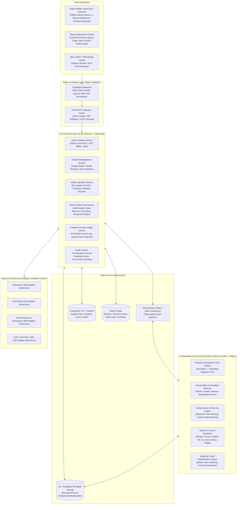
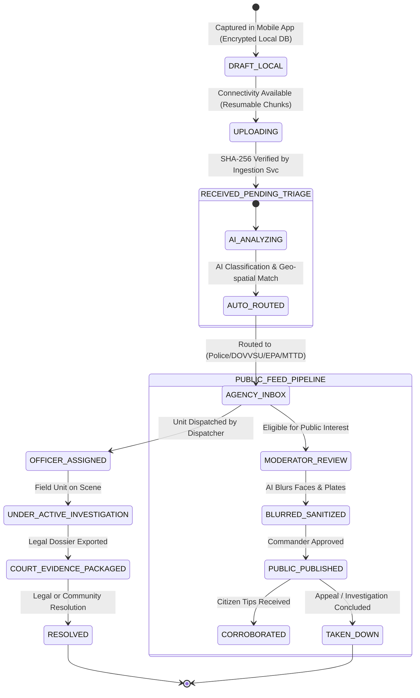

# CitizenAlert Ghana — High-Level System Architecture

## 1. System Vision & Architecture Principles
CitizenAlert Ghana is a mission-critical, national-scale civic safety and emergency response platform built for resilience, strict data protection, evidentiary integrity, and accessibility across all 16 regions of Ghana.

### Core Architectural Principles
1. **Private-First & Safety By Design:** Raw citizen submissions, suspect footage, and private individual details are routed strictly to authenticated government agency queues. Public publication is an intentional, moderated, anonymized, and cryptographically auditable action.
2. **Offline-First & Network Resilient:** Designed to function seamlessly across 2G/3G/4G/5G and intermittent power/network environments with client-side encrypted queues and resumable chunked S3 uploads.
3. **Evidentiary Rigor (Act 772 Compliance):** In-app camera captures embed hardware attestation, UTC timestamp, GPS coordinates, and compute SHA-256 frame hashes on-device before transmission, backed by immutable audit access logs.
4. **Adapter Pattern for Extensibility:** All external national infrastructure (GhanaPost GPS, NIA Ghana Card, Telco SMS/USSD/Cell-Broadcast, Police Dispatch) operates behind strict interface adapters with deterministic, realistic mock fallbacks.
5. **Least Privilege & Role-Based Access (RBAC/ABAC):** Agency operators have scoped access limited strictly by their agency jurisdiction, geographic district, and clearance tier.

---

## 2. End-to-End Component Topology

---

## 3. Incident Lifecycle State Machine

---

## 4. Key Performance & Resilience Targets

| Metric | Target | Architecture Provision |
|:---|:---|:---|
| **Incident Ingestion Latency** | $< 1.5\text{s}$ (metadata acknowledgment) | Async decoupled ingestion via Redis queue + S3 pre-signed upload. |
| **Amber/Red Alert Broadcast Speed** | $< 30\text{s}$ to 1,000,000 devices | Redis Geo-index + FCM parallel topic batches + Telco Cell-Broadcast adapter. |
| **Media Processing Turnaround** | $< 45\text{s}$ for 60-second video | Celery worker pool running hardware-accelerated FFmpeg & lightweight ONNX models. |
| **Offline Resilience** | 100% capture availability | SQLite local database with AES-256-GCM encryption and background auto-sync. |
| **Data Durability & Integrity** | 99.999999999% (11 9s) | Multi-region S3 storage with immutable bucket versioning and SHA-256 checksums. |
